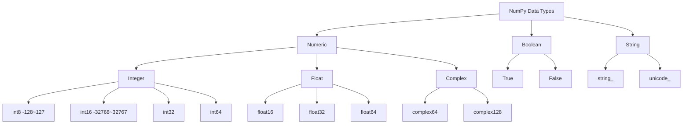

> [!Note]
> Reference URLs:
>
> - Official Numpy Documentation in Chinese: [https://www.numpy.org.cn/]
> - Simple Numpy Tutorial: [https://numpy123.com/]

## 1. Introduction to Numpy

### 1. The Role of Numpy

Numpy is a scientific computing library for Python that supports large multi-dimensional arrays and matrices, along with a collection of high-performance mathematical functions to operate on these arrays. Numpy is the foundation for libraries like Scipy, Pandas, and others used for data processing or scientific computing.

In simple terms, Numpy is a fast mathematical computation library primarily used for array calculations. Its core is the ndarray object, which is an N-dimensional array, also known as a multi-dimensional array. Additionally, Numpy provides many broadcasting functions, tools to integrate C/C++/Fortran code, and can be used to store and process large matrices. It also offers functionalities like linear algebra, Fourier transform, and random number generation, making it the fundamental library for scientific computing in Python.

Numpy has the following advantages:

1. Fast computation: Numpy is written in C, so some of its algorithm libraries are optimized to provide fast mathematical operations. For the same computational tasks, using Numpy is 10 to 100 times faster than using Python's built-in lists.
2. Performance optimization: Numpy uses vectorized operations internally, which avoids loops in Python, making the code more concise and faster.
3. Rich function library: Numpy provides a large number of mathematical functions for array operations, including statistics, linear algebra, Fourier transform, etc.




Numpy is often used together with Scipy (scientific computing library), Matplotlib (plotting library), and Pandas (data processing library). These libraries are all based on Numpy, forming a powerful scientific computing environment.

### 2. ndarray Object

The core of Numpy is the ndarray object, an N-dimensional array object, also known as a multi-dimensional array. The ndarray object is a fast and flexible container for large datasets, capable of holding multiple elements of the same type.

- The ndarray object is a collection of `same type of data`, which can be of any dimension.
- Each element in the ndarray object occupies the same size area in memory.
- The indices in the ndarray object start from 0.

> [!Important]
> By default, all elements in a Numpy ndarray object are of the same type, which is different from Python lists. If different types of data are passed when creating an ndarray, Numpy will automatically convert the data types to the same type to ensure consistency, with the priority being: `bool` < `int` < `float` < `str`.

## 2. Creating ndarray Objects

### 1. Data Types

To create an ndarray object, you first need to know which data types it supports.

Numpy provides more rich and efficient data types than Python's built-in types to support more complex numerical computation needs. Below are some common Numpy data types:

|    Data Type    |                       Description                       |
| :--------: | :--------------------------------------------: |
|  `bool_`   |            Boolean data type, includes only True and False            |
|   `int_`   | Default integer type, similar to long in C, usually int32 or int64, depending on the platform |
|   `intp`   |  Integer type used for indexing, similar to ssize_t in C, generally int32 or int64  |
|  `uint8`   |             8-bit unsigned integer, range from 0 to 255             |
|  `uint64`  |    64-bit unsigned integer, range from 0 to 18446744073709551615    |
|  `float_`  |       Default floating-point type, alias for float64, usually used for more precise floating-point representation       |
| `float64`  |      Double precision floating-point number (64-bit): includes 1-bit sign, 11-bit exponent, and 52-bit mantissa      |
| `complex_` |   Default complex type, alias for complex128, uses 64-bit floating-point numbers to represent real and imaginary parts    |

<MermaidDiagram>
graph LR
    A[Data Types] --> B[Boolean Type]
    A --> C[Integer Type]
    A --> D[Unsigned Integer Type]
    A --> E[Floating-point Type]
    A --> F[Complex Type]

    B --> G[bool_]

    C --> H[int_]
    C --> I[intp]

    D --> J[uint8]
    D --> K[uint64]

    E --> L[float_]
    E --> M[float64]

    F --> N[complex_]
</MermaidDiagram>

These data types are called `dtype` objects in Numpy, supporting efficient numerical computation, making Numpy an important tool in scientific computing and data processing.

In practice, Numpy supports using character codes to identify data types, making the definition of data types more concise. Below are common character codes and their corresponding data types:

| Character Code | Data Type |
| :---: | :---: |
| `b` | Boolean (bool) |
| `i` | Signed integer (int) |
| `u` | Unsigned integer (unsigned int) |
| `f` | Floating-point (float) |
| `c` | Complex floating-point (complex) |
| `m` | Time interval (timedelta) |
| `M` | Date-time (datetime) |
| `O` | Python object (object) |
| `S` | String (string) |
| `U` | Unicode string (unicode string) |
| `V` | Raw data type (void), used to define fixed-size raw data blocks |

In Numpy, we can also customize `dtype` objects to achieve more flexible data type definitions. A `dtype` object contains metadata about the data type, such as the data type name, data size, byte order, etc. We can use the `np.dtype()` function to create a `dtype` object, which accepts a list where each element is a tuple in the format: `(field name, data type)`. For example, we can create a custom data type containing integer and floating-point fields:

```python
import numpy as np

# Define a structure containing an integer and a floating-point number
custom_dtype = np.dtype([('age', np.int32), ('height', np.float32)])
```

In the above example, the custom data type `custom_dtype` contains two fields:

- age: `np.int32` type integer field
- height: `np.float32` type floating-point field

### 2. Common Functions to Create ndarray Objects

In Numpy, there are the following commonly used functions to create ndarray objects:

<MermaidDiagram>
graph LR
    A["Functions to Create ndarray Objects"] 
    A --> B["Basic Creation Functions"]
    A --> C["Creation Based on Existing Arrays"]
    A --> D["Special Matrix Creation"]
    A --> E["Sequence Creation"]

    B --> G["array()"]
    B --> H["asarray()"]
    B --> I["empty()"]
    B --> J["zeros()"]
    B --> K["full()"]

    C --> L["zeros_like()"]
    C --> M["full_like()"]

    D --> N["eye()"]

    E --> O["arange()"]
    E --> P["linspace()"]
</MermaidDiagram>

#### (1) Basic Creation Functions

1. `array()` Function

We can use the `array()` function to create an ndarray object from Python sequence types like lists or tuples. The syntax of this function is as follows:

```python
numpy.array(object, dtype=None, copy=True, order=None, subok=False, ndmin=0)
```

Parameter Description:

- `object`: The Python sequence type to be passed, such as a list or tuple.
- `dtype`: Data type (optional). If not specified, Numpy will automatically infer the appropriate data type.
- `copy`: Boolean value (optional). If `True` (default), a new object will be created; if `False`, the existing object will be referenced directly.
- `order`: Order (optional), the style of creating the array. C row-major (row direction), F column-major (column direction), A any direction (default).
- `subok`: Boolean value (optional). Default is `False`, returns base class array; if `True`, returns subclass array.
- `ndmin`: Specifies the minimum number of dimensions of the generated array (optional).

Below are some examples of creating ndarray objects:

Example 1: Creating an `ndarray` object from a list

::code-mirror-run{:editable="true" maxHeight="20rem" :showInCol="true"}

```python
import numpy as np

# Create an ndarray object from a list
arr = np.array([1, 2, 3, 4])
print(arr)
print(type(arr))
```

::

Example 2: Elements in the `ndarray` object are of the same type

```python
# Even if the provided data types are inconsistent, Numpy will automatically convert them to a single type
arr_mixed = np.array([1, 2.5, 3, 4.7])
print(arr_mixed)
print(arr_mixed.dtype)

# Output
# [1.  2.5 3.  4.7]
# float64
```

Example 3: Creating a multi-dimensional `ndarray` object

::code-mirror-run{:editable="true" maxHeight="20rem" :showInCol="true"}

```python
# Create a two-dimensional array
multi_dim_arr = np.array([[1, 2, 3], [4, 5, 6]])
print(multi_dim_arr)
print("Array dimensions:", multi_dim_arr.ndim)
```

::

Example 4: Using the `dtype` parameter to specify the data type

```python
# Use dtype to specify the data type as float
arr_float = np.array([1, 2, 3], dtype=np.float32)
print(arr_float)
print(arr_float.dtype)

# Output
# [1. 2. 3.]
# float32
```

Example 5: Customizing a `dtype` object and using it to create an `ndarray` object

::code-mirror-run{:editable="true" maxHeight="20rem" :showInCol="true"}

```python
# Custom dtype containing an integer and a floating-point field
custom_dtype = np.dtype([('age', np.int32), ('height', np.float32)])
arr_custom = np.array([(25, 5.9), (30, 6.1)], dtype=custom_dtype)
print(arr_custom)
print(arr_custom['age'])
print(arr_custom['height'])
```

::

Through these examples, we can see that the `array()` function in Numpy provides powerful flexibility, making it easier to create diverse data structures.

2. `empty()`, `zeros()`, and `full()` Functions

In addition to using the `array()` and `asarray()` functions, we can also use the `empty()` and `zeros()` functions to create ndarray objects. These two functions are typically used to create arrays of specified shapes but do not initialize the array elements.

- The `empty()` function creates an array of a specified shape with uninitialized elements, meaning the elements will have random values.
- The `zeros()` function creates an array of a specified shape with all elements initialized to 0.

Their syntax is as follows:

```python
# empty() function
numpy.empty(shape, dtype=float, order='C')

# zeros() function
numpy.zeros(shape, dtype=float, order='C')
```

Parameter Description:

- `shape`: The shape of the array, which can be an integer or a tuple of integers. For example, 5 represents a one-dimensional array, and (2, 3) represents a two-dimensional array with 2 rows and 3 columns.
- `dtype`: Data type (optional). If not specified, Numpy will automatically infer the appropriate data type.
- `order`: Order (optional), the style of creating the array. C row-major (row direction), F column-major (column direction).

Below is an example of creating arrays using the `empty()` and `zeros()` functions:

::code-mirror-run{:editable="true" maxHeight="20rem" :showInCol="true"}

```python
import numpy as np

# Create a 2x3 uninitialized array using the empty() function
empty_array = np.empty((2, 3))
print("Array created using empty():\n", empty_array)

# Create a 2x3 array with all elements as 0 using the zeros() function
zeros_array = np.zeros((2, 3))
print("Array created using zeros():\n", zeros_array)
```

::

> [!Note]
> In addition to the `zeros()` function, Numpy also provides the `ones()` function to create an array of specified shape with all elements as 1. The syntax of the `ones()` function is the same as that of the `zeros()` function, except that it initializes the array elements to 1.

If you want more flexibility in initializing array elements, you can use the `full()` function, which allows you to specify the value to initialize the array elements. Its syntax is as follows:

```python
numpy.full(shape, fill_value, dtype=None, order='C')
```

Parameter Description:

- `shape`: The shape of the array, which can be an integer or a tuple of integers.
- `fill_value`: The value to initialize the array elements.
- `dtype`: Data type (optional). If not specified, Numpy will automatically infer the appropriate data type.
- `order`: Order (optional), the style of creating the array. C row-major (row direction), F column-major (column direction).

Below is an example of creating an array using the `full()` function:

```python
import numpy as np
# Create a 2x3 array with all elements as 5 using the full() function
full_array = np.full((2, 3), 5)
print("Array created using full():\n", full_array)

# Output
# Array created using full()
# [[5 5 5]
# [5 5 5]]
```

#### (2) Creation Based on Existing Arrays

In addition to the `empty()`, `zeros()`, `ones()`, and `full()` functions, Numpy also provides the `zeros_like()` and `full_like()` functions to create arrays of the same shape as a specified array, with all elements initialized to 0 or a specified value. The syntax of these two functions is as follows:

```python
# zeros_like() function
numpy.zeros_like(a, dtype=None, order='K', subok=True)

# full_like() function
numpy.full_like(a, fill_value, dtype=None, order='K', subok=True)
```

Parameter Description:

- `a`: The input array, used to specify the shape of the new array.
- `fill_value`: The value to initialize the array elements.
- `dtype`: Data type (optional). If not specified, Numpy will automatically infer the appropriate data type.
- `order`: Order (optional), the style of creating the array. C row-major (row direction), F column-major (column direction), K to keep the memory layout order of the input array.
- `subok`: Boolean value (optional). Default is `True`, returns subclass array; if `False`, returns base class array.

Below is an example of creating arrays using the `zeros_like()` and `full_like()` functions:

::code-mirror-run{:editable="true" maxHeight="20rem" :showInCol="true"}

```python
import numpy as np

# Create a sample array
a = np.array([[1, 2, 3], [4, 5, 6]])

# Create an array of the same shape as 'a' with all elements as 0 using the zeros_like() function
zeros_like_a = np.zeros_like(a)
print("Array of the same shape as 'a' with all elements as 0:\n", zeros_like_a)

# Create an array of the same shape as 'a' with all elements as 7 using the full_like() function
full_like_a = np.full_like(a, fill_value=7)
print("Array of the same shape as 'a' with all elements as 7:\n", full_like_a)
```

::

## 3. Properties of ndarray Objects

The number of dimensions of a Numpy array is called its rank. A one-dimensional array has a rank of 1, a two-dimensional array has a rank of 2, and so on. The shape of an array is called its dimension, and each dimension is called an axis. For example, the length of the first axis of a two-dimensional array is the number of rows, and the length of the second axis is the number of columns.

The ndarray object in Numpy has the following important properties:

<MermaidDiagram>
graph TD
    A["Properties of ndarray Objects"]
    A --> B["ndim"]
    A --> C["shape"]
    A --> D["size"]
    A --> E["dtype"]
</MermaidDiagram>

- `ndarray.ndim`: The number of dimensions (rank) of the array, representing the number of axes. For example, a two-dimensional array has an `ndim` of 2, and a three-dimensional array has an `ndim` of 3.

```python
import numpy as np
a = np.array([[1, 2, 3], [4, 5, 6]])
print(a.ndim)

# Output
#2
```

- `ndarray.shape`: The shape of the array, returning a tuple representing the size of the array in each dimension. For a two-dimensional array with `n` rows and `m` columns, `shape` returns `(n, m)`.

```python
print(a.shape) # Output: (2, 3)
```

- `ndarray.size`: The total number of elements in the array, equal to the product of the sizes of all dimensions in the `shape` tuple. For an array with a shape of `(2, 3)`, `size` is `2 * 3 = 6`.

```python
print(a.size) # Output: 6
```

- `ndarray.dtype`: The data type of the elements in the array, such as `int32`, `float64`, etc.

```python
print(a.dtype) # Output: int64
```

These are the common properties of the ndarray object, which can help us better understand the structure and characteristics of arrays.

## 4. Array Operations

### 1. Operations on Multi-dimensional Arrays

Numpy provides many mathematical functions for performing operations on arrays. Here, we mainly introduce two types:

- Arithmetic functions: Used to perform basic arithmetic operations such as addition, subtraction, multiplication, and division.
- Trigonometric functions: Used to perform trigonometric operations such as sin, cos, and tan.

#### (1) Arithmetic Functions

Numpy provides many arithmetic functions for performing basic arithmetic operations such as addition, subtraction, multiplication, and division. Below are some commonly used arithmetic functions:

- `add()`: Used to perform addition.
- `subtract()`: Used to perform subtraction.
- `multiply()`: Used to perform multiplication.
- `divide()`: Used to perform division.
- `power()`: Used to perform exponentiation.

Below are examples of these arithmetic functions. First, we need to define two arrays for demonstration:

::code-mirror-run{:editable="true" maxHeight="20rem" :showInCol="true"}

```python
import numpy as np

# Define two arrays for demonstration
array1 = np.array([10, 20, 30, 40])
array2 = np.array([2, 4, 5, 8])
```

::

1. Addition: `add()`, element-wise addition of array1 and array2

::code-mirror-run{:editable="true" maxHeight="20rem" :showInCol="true"}

```python
result_add = np.add(array1, array2)
print("Addition result:", result_add)
```

::

2. Subtraction: `subtract()`, element-wise subtraction of array2 from array1

::code-mirror-run{:editable="true" maxHeight="20rem" :showInCol="true"}

```python
result_subtract = np.subtract(array1, array2)
print("Subtraction result:", result_subtract)
```

::

3. Multiplication: `multiply()`, element-wise multiplication of array1 and array2

```python
result_multiply = np.multiply(array1, array2)
print("Multiplication result:", result_multiply)

# Output
# Multiplication result: [ 20  80 150 320]
```

4. Division: `divide()`, element-wise division of array1 by array2, resulting in floating-point numbers

```python
result_divide = np.divide(array1, array2)
print("Division result:", result_divide)

# Output
# Division result: [5. 5. 6. 5.]
```

5. Exponentiation: `power()`, element-wise exponentiation with elements of array1 as the base and elements of array2 as the exponent

```python
result_power = np.power(array1, array2)
print("Exponentiation result:", result_power)

# Output
# Exponentiation result: [          100        160000      24300000 6553600000000]
```

#### (2) Mathematical Functions

Numpy includes a large number of mathematical functions for performing various mathematical operations. Here are two commonly used mathematical functions: the sum function `sum()` and the rounding function `around()`.

1. `sum()` Function

The `sum()` function is used to calculate the sum of elements in an array. Its syntax is as follows:

```python
numpy.sum(a, axis=None, dtype=None, keepdims=False)
```

Parameter Description:

- `a`: The input array.
- `axis`: Specifies the axis along which to compute the sum. If `None`, the sum of all elements is computed; if an integer, the sum along the specified axis is computed; if a tuple, the sum along multiple specified axes is computed.
- `dtype`: Data type (optional). If not specified, Numpy will automatically infer the appropriate data type.
- `keepdims`: Boolean value (optional). If `True`, the output array will have the same number of dimensions as the input array.

Below is an example of using the `sum()` function to calculate the sum of array elements:

::code-mirror-run{:editable="true" maxHeight="20rem" :showInCol="true"}

```python
import numpy as np

# Create a two-dimensional array
a = np.array([[1, 2, 3], [4, 5, 6]])

# Calculate the sum of all elements
total_sum = np.sum(a)
print("Sum of all elements:", total_sum)

# Calculate the sum of each column
column_sum = np.sum(a, axis=0)
print("Sum of each column:", column_sum)

# Calculate the sum of each row
row_sum = np.sum(a, axis=1)
print("Sum of each row:", row_sum)
```

::

2. `around()` Function

The `around()` function is used to round the elements in an array to the specified number of decimal places. Its syntax is as follows:

```python
numpy.around(a, decimals=0)
```

Parameter Description:

- `a`: The input array.
- `decimals`: Specifies the number of decimal places. The default is 0, which means rounding to the nearest integer.

Below is an example of using the `around()` function to round the elements in an array to the specified number of decimal places:

::code-mirror-run{:editable="true" maxHeight="20rem" :showInCol="true"}

```python
import numpy as np

# Create an array containing floating-point numbers
a = np.array([1.123, 2.456, 3.789, 4.101])

# Round the elements to the nearest integer
rounded_a = np.around(a)
print("Rounded to the nearest integer:", rounded_a)

# Round the elements to two decimal places
rounded_a_2_decimals = np.around(a, decimals=2)
print("Rounded to two decimal places:", rounded_a_2_decimals)
```

::

### 2. Broadcasting

Broadcasting is an important concept in Numpy that refers to arithmetic operations between arrays of different shapes. In broadcasting, Numpy automatically adjusts the shapes of the arrays so that they can be operated on together.

If there are two arrays of the same shape (i.e., `a.shape == b.shape`), Numpy performs element-wise operations when computing them. For example, when performing addition on two arrays of the same shape, Numpy adds the corresponding elements of the two arrays to generate a new array.

From the above example, we can see how to use Numpy to perform basic arithmetic operations on two arrays of the same shape. Each operation is performed element-wise, meaning that each element in the result array is obtained by performing the operation on the corresponding elements of the first and second arrays.

However, more often than not, the shapes of the two arrays being operated on are not the same. In such cases, Numpy automatically adjusts the shapes of the arrays so that they can be operated on together. This mechanism is called "broadcasting." Broadcasting involves broadcasting the smaller array to the size of the larger array so that their shapes match, and then performing element-wise operations.

Below is an example of broadcasting:

::code-mirror-run{:editable="true" maxHeight="20rem" :showInCol="true"}

```python
import numpy as np

# Create a 2x3 array
a = np.array([[1, 2, 3], [4, 5, 6]])

# Create a 1x3 array
b = np.array([10, 20, 30])

# Perform addition on the two arrays
result = a + b

print("Array a:\n", a)
print("Array b:\n", b)
print("Result of a + b:\n", result)
```

::

The rules of broadcasting are as follows:

- Dimension matching: If the number of dimensions of the two arrays is different, the smaller array will have 1s prepended to its shape until the number of dimensions matches.
- Dimension compatibility: Starting from the last dimension, if the sizes of the two arrays are equal, or if one of the sizes is 1, the dimensions are considered compatible.
- Dimension expansion: If the shapes of the two arrays do not match in any dimension and neither dimension size is 1, an exception is raised.

<MermaidDiagram>
graph TD
    A["Broadcasting Rules"]
    A --> B["Dimension Matching"]
    A --> C["Dimension Compatibility"]
    A --> D["Dimension Expansion"]
</MermaidDiagram>

In simple terms, for two arrays, if their shapes match in any dimension, or if one of the dimensions is 1, the arrays are considered compatible and can be broadcasted.

Here are some examples to better understand the concept of broadcasting:

Example 1: Adding a one-dimensional array to a two-dimensional array

```python
import numpy as np

# Create a 3x3 two-dimensional array
a = np.arange(9).reshape(3, 3)
# Create a one-dimensional array
b = np.arange(3)

# Perform broadcasting addition
c = a + b

# Output the result
print(c)

# Output
# [[ 0  2  4]
# [ 3  5  7]
# [ 6  8 10]]
```

In this example, `b` is a one-dimensional array with a shape of (3,). It is broadcasted to each row of `a`, so that each element is added to the corresponding element in `b`.

Example 2: Adding a scalar to an array

```python
import numpy as np

# Create a one-dimensional array
a = np.array([1, 2, 3])

# Add the scalar 2 to the array
b = a + 2

# Output the result
print(b)

# Output
# [3 4 5]
```

In this example, the scalar 2 is broadcasted to each element of `a`, so that each element is incremented by 2.

Example 3: Multiplying arrays of different shapes

```python
import numpy as np

# Create a 2x3 two-dimensional array
a = np.array([[1, 2, 3], [4, 5, 6]])
# Create a 1x3 two-dimensional array
b = np.array([[1, 2, 3]])

# Perform broadcasting multiplication
c = a * b

# Output the result
print(c)

# Output
# [[ 1  4  9]
# [ 4 10 18]]
```


## 5. Indexing and Slicing

### 1. Basic Indexing and Slicing

Similar to the list object in Python, the contents of an ndarray object in Numpy can be accessed and modified through indexing or slicing. The indexing of an ndarray object starts from 0, and elements can be accessed using square brackets `[i, j]` to access the element in the `i`-th row and `j`-th column. Here are some examples:

::code-mirror-run{:editable="true" maxHeight="20rem" :showInCol="true"}

```python
import numpy as np

# Create a 4x4 array
a = np.array([[1, 2, 3, 4], [5, 6, 7, 8], [9, 10, 11, 12], [13, 14, 15, 16]])

# Access the subarray from the 2nd to the 3rd row and the 2nd to the 3rd column
sub_array = a[1:3, 1:3]
print("Accessed subarray:\n", sub_array)

# Modify the subarray from the 1st to the 2nd row and the 1st to the 2nd column
a[0:2, 0:2] = np.array([[0, 0], [0, 0]])
print("Modified array:\n", a)
```

::

Similar to slicing operations on lists in Python, we can also slice ndarray objects to obtain subarrays. In slicing operations, we can use `:` to represent the entire axis, and `start:stop:step` to represent the range from `start` to `stop` (excluding the `stop` position), with a step size of `step`. Here are some examples:

```python
import numpy as np

# Create a 2x3 ndarray
arr = np.array([[1, 2, 3], [4, 5, 6]])

# Get the first row
first_row = arr[0, :]
print("First row:", first_row)

# Output
# First row: [1 2 3]

# Get the second column
second_column = arr[:, 1]
print("Second column:", second_column)

# Output
# Second column: [2 5]

# Get a subarray
sub_array = arr[0:2, 1:3]
print("Subarray:\n", sub_array)

# Output
# Subarray:
# [[2 3]
# [5 6]]
```

If the start and stop values are not specified, `:` represents the entire axis. In slicing operations, we can also use negative indices to count from the end of the array. For example, `-1` represents the last element of the array, `-2` represents the second-to-last element, and so on.

In slicing, we can also use `...` to represent selecting all dimensions of the array, even if the length of the selection tuple is the same as the number of dimensions of the array. For example, `arr[..., 1]` represents selecting the second column of the array, and `arr[1, ...]` represents selecting the second row of the array. For example:

Example 1: Select the second column of the array

::code-mirror-run{:editable="true" maxHeight="20rem" :showInCol="true"}

```python
import numpy as np

# Create a 3x3x3 example array
arr = np.arange(27).reshape(3, 3, 3)

print("Original array:\n", arr)

example1 = arr[..., 1]
# Explanation: Select all dimensions of the array and select the second column
print("Example 1:\n", example1)
```

::

Example 2: Select the last element of the array

::code-mirror-run{:editable="true" maxHeight="20rem" :showInCol="true"}

```python
import numpy as np

# Create a 3x3x3 example array
arr = np.arange(27).reshape(3, 3, 3)

print("Original array:\n", arr)

example3 = arr[..., -1]
# Explanation: Select all dimensions of the array and select the last element
print("Example 2:\n", example3)
```

::

Example 3: Select the first plane of the array

::code-mirror-run{:editable="true" maxHeight="20rem" :showInCol="true"}

```python
import numpy as np

# Create a 3x3x3 example array
arr = np.arange(27).reshape(3, 3, 3)

print("Original array:\n", arr)

example4 = arr[0, ...]
# Explanation: Select the first plane of the array and select all dimensions
print("Example 3:\n", example4)
```

::

In addition to directly using the `[start:stop:step]` method for slicing, we can also use the `slice()` function to create slice objects and then use these slice objects in the array. The syntax of the `slice()` function is as follows:

```python
slice(start, stop, step)
```

Below is an example of using the `slice()` function to create slice objects:

```python
import numpy as np

# Create a 4x4 ndarray
arr = np.array([[1, 2, 3, 4], 
                [5, 6, 7, 8], 
                [9, 10, 11, 12], 
                [13, 14, 15, 16]])

# Use the slice() function to create slice objects
first_slice = slice(1, 3)
second_slice = slice(1, 3)

# Use the slice objects to get a subarray
sub_array = arr[first_slice, second_slice]
print("Subarray created using slice() function:\n", sub_array)

# Output
# Subarray created using slice() function:
# [[ 6  7]
# [10 11]]
```

Using the `slice()` function to create slice objects allows for more flexible slicing operations on arrays. The advantages include:

- Higher readability: Using the `slice()` function can make the code more readable, especially when the slicing range is complex. By naming the slice objects, the intent of the slicing can be more clearly expressed.
- Code reusability: Slice objects can be reused, avoiding the need to repeatedly write the same slicing range in multiple places. For example, the same slice object can be used on multiple arrays.
- Flexibility: Slice objects can be dynamically created, allowing the slicing range to be adjusted based on different conditions without modifying the array access code.

### 2. Boolean Indexing

In Numpy, we can use boolean indexing to access elements in an array that meet specific conditions.

Boolean indexing accesses elements in an array using a boolean array, which must have the same length as the array. In boolean indexing, `True` indicates that the element is retained, and `False` indicates that the element is discarded. In simple terms, boolean indexing uses boolean operations (such as comparison operations) to obtain elements that meet specified conditions.

Below is an example of using boolean indexing to access elements in an array:

::code-mirror-run{:editable="true" maxHeight="20rem" :showInCol="true"}

```python
import numpy as np

# Create an array
a = np.array([1, 2, 3, 4, 5, 6, 7, 8, 9, 10])

# Create a boolean array with the condition that elements are greater than 5
bool_index = a > 5

# Use boolean indexing to access elements in the array
filtered_a = a[bool_index]
print("Elements greater than 5:", filtered_a)
```

::

In this example, we first create an array `a`, then create a boolean array `bool_index` where the elements are whether the elements in `a` are greater than 5. Finally, we use boolean indexing `a[bool_index]` to access the elements in `a` that are greater than 5.

In addition to using comparison operators, we can also use logical operators to combine multiple conditions. For example, we can use `&` for logical AND, `|` for logical OR, and `~` for logical NOT. Below is an example of using logical operators to combine multiple conditions:

```python
import numpy as np

# Create an array
a = np.array([1, 2, 3, 4, 5, 6, 7, 8, 9, 10])

# Use logical operators to combine multiple conditions
# Condition: elements greater than 3 and less than 8
bool_index = (a > 3) & (a < 8)

# Use boolean indexing to access elements in the array
filtered_a = a[bool_index]
print("Elements greater than 3 and less than 8:", filtered_a)

# Condition: elements less than 3 or greater than 8
bool_index_or = (a < 3) | (a > 8)

# Use boolean indexing to access elements in the array
filtered_a_or = a[bool_index_or]
print("Elements less than 3 or greater than 8:", filtered_a_or)

# Output
# Elements greater than 3 and less than 8: [4 5 6 7]
# Elements less than 3 or greater than 8: [ 1  2  9 10]
```

## 6. Array Operations

### 1. Modifying Array Shapes

#### (1) Simple Array Shape Modification

In Numpy, we can change the dimensions of an array by modifying its shape. Numpy provides several methods to modify the shape of an array, with the most commonly used being the `reshape()` function.

The `reshape()` function is used to modify the shape of an array and returns a new array, while the shape of the original array remains unchanged. The syntax of the `reshape()` function is as follows:

```python
numpy.reshape(a, newshape, order='C')
```

Parameter Description:

- `a`: The array to be reshaped.
- `newshape`: The new shape, which can be an integer or a tuple of integers.
- `order`: Order (optional), the style of creating the array. C row-major (row direction), F column-major (column direction), A any direction (default), K as they appear in memory.

Below is an example of using the `reshape()` function to modify the shape of an array:

::code-mirror-run{:editable="true" maxHeight="20rem" :showInCol="true"}

```python
import numpy as np

# Create a one-dimensional array
a = np.array([1, 2, 3, 4, 5, 6])

# Use the reshape() function to modify it to a 2x3 two-dimensional array
b = np.reshape(a, (2, 3))

print("Original array:")
print(a)

print("Reshaped array:")
print(b)
```

::

#### (2) Transposing Arrays

In Numpy, the `transpose()` function and the `T` attribute are commonly used to transpose arrays.

- The `transpose()` function is used to swap the dimensions of an array and returns a new array, while the shape of the original array remains unchanged.
- The `T` attribute is used to transpose an array and returns a new array, while the shape of the original array remains unchanged.

Additionally, the `rollaxis()` function and the `swapaxes()` function can be used to swap the dimensions of an array.

1. `transpose()` Function

The `transpose()` function is used to swap the dimensions of an array and returns a new array, while the shape of the original array remains unchanged. The syntax of the `transpose()` function is as follows:

```python
numpy.transpose(a, axes=None)
```

Parameter Description:

- `a`: The array whose dimensions are to be swapped.
- `axes`: The new order of the dimensions. If not specified, the order of the dimensions will be reversed.

Below is an example of using the `transpose()` function to swap the dimensions of an array:

::code-mirror-run{:editable="true" maxHeight="20rem" :showInCol="true"}

```python
import numpy as np

# Create a two-dimensional array
a = np.array([[1, 2, 3], [4, 5, 6]])

# Use the transpose() function to swap the dimensions of the array
b = np.transpose(a)

print("Original array:")
print(a)

print("Array with swapped dimensions:")
print(b)
```

::

2. `T` Attribute

The `T` attribute is used to transpose an array and returns a new array, while the shape of the original array remains unchanged. The syntax of the `T` attribute is as follows:

```python
numpy.ndarray.T
```

Below is an example of using the `T` attribute to transpose an array:

::code-mirror-run{:editable="true" maxHeight="20rem" :showInCol="true"}

```python
import numpy as np

# Create a two-dimensional array
array = np.array([[1, 2, 3], [4, 5, 6]])

# Use the T attribute to transpose the array
transposed_array = array.T

print("Original array:")
print(array)

print("Transposed array:")
print(transposed_array)
```

::

#### (3) Adding or Removing Array Dimensions

In Numpy, the following functions are commonly used to add or remove array dimensions:

- `expand_dims()`: Used to insert a new axis at a specified position, returning a new array.
- `squeeze()`: Used to remove single-dimensional entries from the shape of an array, returning a new array.

1. `expand_dims()` Function

The `expand_dims()` function is used to insert a new axis at a specified position, thereby expanding the dimensions of an array. This is useful when adjusting the shape of an array to match the input requirements of specific operations or functions.

```python
numpy.expand_dims(array, axis)
```

Parameter Description:

- `array`: The array in which to insert the new axis.
- `axis`: The position of the new axis.

Below is an example of using the `expand_dims()` function to insert a new axis at a specified position:

::code-mirror-run{:editable="true" maxHeight="20rem" :showInCol="true"}

```python
import numpy as np

# Original one-dimensional array with shape (3,)
array1 = np.array([1, 2, 3])
print("Original array shape:", array1.shape)
print("Original array:\n", array1)

# Use expand_dims() to insert a new axis at the first position (axis 0)
expanded_array = np.expand_dims(array1, axis=0)
print("\nShape after inserting new axis at axis 0:", expanded_array.shape)
print("Expanded array:\n", expanded_array)

# Use expand_dims() to insert a new axis at the last position (axis 1)
expanded_array_2 = np.expand_dims(array1, axis=1)
print("\nShape after inserting new axis at axis 1:", expanded_array_2.shape)
print("Expanded array:\n", expanded_array_2)
```

::

2. `squeeze()` Function

The `squeeze()` function is used to remove single-dimensional entries from the shape of an array, returning a new array. This is useful when dealing with arrays, such as removing unnecessary single-dimensional entries to simplify the shape of the array.

```python
numpy.squeeze(array, axis=None)
```

Parameter Description:

- `array`: The array from which to remove single-dimensional entries.
- `axis`: The axis to remove. The default is `None`, which removes all single-dimensional entries.

Below is an example of using the `squeeze()` function to remove single-dimensional entries from an array:

::code-mirror-run{:editable="true" maxHeight="20rem" :showInCol="true"}

```python
import numpy as np

array1 = np.array([[[[1, 2, 3, 4]],
                    [[5, 6, 7, 8]],
                    [[9, 10, 11, 12]]]])  # Shape is (1, 3, 1, 4)

# Use squeeze() to remove all single-dimensional entries
squeezed_array = np.squeeze(array1)
print("Array after removing single-dimensional entries:\n", squeezed_array)
print("Shape after removing single-dimensional entries:", squeezed_array.shape)
```

::

### 2. Array Concatenation and Splitting

#### (1) Concatenating Arrays

In Numpy, the `concatenate()` function is used to concatenate arrays along a specified axis, returning a new array. The syntax of the `concatenate()` function is as follows:

```python
numpy.concatenate((a1, a2, ...), axis=0)
```

Parameter Description:

- `a1, a2, ...`: The arrays to be concatenated.
- `axis`: The axis along which to concatenate the arrays. The default is 0.

Below is an example of using the `concatenate()` function to concatenate arrays:

::code-mirror-run{:editable="true" maxHeight="20rem" :showInCol="true"}

```python
import numpy as np

# Create two example arrays
a1 = np.array([[1, 2], [3, 4]])
a2 = np.array([[5, 6], [7, 8]])

# Concatenate arrays along the first axis (rows)
concatenated_axis_0 = np.concatenate((a1, a2), axis=0)
print("Array concatenated along rows:\n", concatenated_axis_0)

# Concatenate arrays along the second axis (columns)
concatenated_axis_1 = np.concatenate((a1, a2), axis=1)
print("Array concatenated along columns:\n", concatenated_axis_1)
```

::

#### (2) Splitting Arrays

In Numpy, the `split()` function is used to split an array along a specified axis, returning a list of arrays. The syntax of the `split()` function is as follows:

```python
numpy.split(array, indices_or_sections, axis=0)
```

Parameter Description:

- `array`: The array to be split.
- `indices_or_sections`: The indices at which to split the array or the number of sections to split into.
- `axis`: The axis along which to split the array. The default is 0.

Below is an example of using the `split()` function to split an array:

::code-mirror-run{:editable="true" maxHeight="20rem" :showInCol="true"}

```python
import numpy as np

# Create an array
array = np.array([1, 2, 3, 4, 5, 6])

# Split the array into three parts
result = np.split(array, 3)

print(result)
```

::

## 7. Array Sorting

Numpy provides various sorting functions that implement different sorting algorithms. However, in most cases, we use the quicksort algorithm, i.e., the `quicksort` algorithm. Therefore, in the following sorting functions, we will not specify the sorting algorithm but use the default quicksort algorithm.

Here, we mainly introduce three commonly used sorting functions: the `sort()` function, the `argsort()` function, and the `lexsort()` function.

### 1. `sort()` Function

The `sort()` function is used to sort an array and returns a new array. The syntax of the `sort()` function is as follows:

```python
numpy.sort(a, axis, kind=None, order=None)
```

Parameter Description:

- `a`: The array to be sorted.
- `axis`: The axis along which to sort.
- `kind`: The sorting algorithm (optional). The default is `None`, which means using the quicksort algorithm.
- `order`: The fields to sort by (optional).

Below is an example of using the `sort()` function to sort an array:

::code-mirror-run{:editable="true" maxHeight="20rem" :showInCol="true"}

```python
import numpy as np

# Create a two-dimensional array
a = np.array([[3, 2, 1], [6, 5, 4]])

# Sort by rows
sorted_by_row = np.sort(a, axis=1)
print("Sorted by rows:\n", sorted_by_row)

# Sort by columns
sorted_by_column = np.sort(a, axis=0)
print("Sorted by columns:\n", sorted_by_column)
```

::

### 2. `argsort()` Function

The `argsort()` function is used to return the indices that would sort an array. The syntax of the `argsort()` function is as follows:

```python
numpy.argsort(a, axis, kind=None, order=None)
```

Below is an example of using the `argsort()` function to return the indices that would sort an array:

::code-mirror-run{:editable="true" maxHeight="20rem" :showInCol="true"}

```python
import numpy as np

# Create a two-dimensional array
a = np.array([[3, 2, 1], [6, 5, 4]])

# Sort by rows
sorted_by_row = np.sort(a, axis=1)
print("Sorted by rows:\n", sorted_by_row)

# Return the indices that would sort by rows
argsorted_by_row = np.argsort(a, axis=1)
print("Indices that would sort by rows:\n", argsorted_by_row)

# Sort by columns
sorted_by_column = np.sort(a, axis=0)
print("Sorted by columns:\n", sorted_by_column)

# Return the indices that would sort by columns
argsorted_by_column = np.argsort(a, axis=0)
print("Indices that would sort by columns:\n", argsorted_by_column)
```

::

It is important to note that the `argsort()` function returns the indices that would sort the array, not the sorted array itself. Therefore, to get the sorted array, you need to use the returned indices to access the elements in the original array.

### 3. `lexsort()` Function

The `lexsort()` function is used to sort based on multiple key arrays and returns an array of indices. Generally, `lexsort()` sorts based on the last array in the `keys` parameter first, then sorts progressively forward.

```python
numpy.lexsort(keys, axis=-1)
```

Parameter Description:

- `keys`: The key arrays to sort by, usually a tuple of multiple arrays. These arrays need to have the same shape and will be sorted from the last array forward.
- `axis`: The axis along which to sort. The default is the last axis (axis=-1).

Below is an example of using the `lexsort()` function to sort multiple arrays:

::code-mirror-run{:editable="true" maxHeight="20rem" :showInCol="true"}

```python
import numpy as np

# Example data
names = np.array(['David', 'Alice', 'Bob', 'Charlie'])
ages = np.array([20, 25, 25, 30])
heights = np.array([180, 160, 175, 150])

# Use lexsort to sort: first by age in ascending order, then by height in ascending order if ages are the same
sorted_indices = np.lexsort((heights, ages))

# Get the sorted data based on the sorted indices
sorted_names = names[sorted_indices]
sorted_ages = ages[sorted_indices]
sorted_heights = heights[sorted_indices]

print("Sorted names:", sorted_names)
print("Sorted ages:", sorted_ages)
print("Sorted heights:", sorted_heights)
```

::

## 8. Statistical Functions

Numpy provides many statistical functions for performing statistical analysis on arrays. Here, we mainly introduce basic statistical functions, which are used to calculate the maximum, minimum, mean, median, standard deviation, etc., of an array.

### (1) `amin()` Function

The `amin()` function is used to calculate the minimum value of an array. The syntax of the `amin()` function is as follows:

```python
numpy.amin(a, axis=None, out=None, keepdims=<no value>, initial=<no value>, where=<no value>)
```

Parameter Description:

- `a`: The array to calculate the minimum value of.
- `axis`: The axis along which to calculate the minimum value. The default is `None`, which means calculating the minimum value of the entire array.
- `out`: The array to store the result.
- `keepdims`: If `True`, the output array will have the same number of dimensions as the input array.
- `initial`: The initial value.
- `where`: The condition to calculate.

Below is an example of using the `amin()` function to calculate the minimum value of an array:

::code-mirror-run{:editable="true" maxHeight="20rem" :showInCol="true"}

```python
import numpy as np

# Create an array
array = np.array([[3, 7, 5], [8, 4, 6], [2, 9, 1]])

# Calculate the minimum value of the entire array
min_value = np.amin(array)

print("Minimum value of the array:", min_value)

# Calculate the minimum value along axis 0
min_value_axis0 = np.amin(array, axis=0)

print("Minimum value along axis 0:", min_value_axis0)

# Calculate the minimum value along axis 1
min_value_axis1 = np.amin(array, axis=1)

print("Minimum value along axis 1:", min_value_axis1)
```

::

### (2) `amax()` Function

The `amax()` function is used to calculate the maximum value of an array. The syntax of the `amax()` function is as follows:

```python
numpy.amax(a, axis=None, out=None, keepdims=<no value>, initial=<no value>, where=<no value>)
```

Below is an example of using the `amax()` function to calculate the maximum value of an array:

::code-mirror-run{:editable="true" maxHeight="20rem" :showInCol="true"}

```python
import numpy as np

# Create an array
array = np.array([[3, 7, 5], [8, 4, 6], [2, 9, 1]])

# Calculate the maximum value of the entire array
max_value = np.amax(array)

print("Maximum value of the array:", max_value)

# Calculate the maximum value along axis 0
max_value_axis0 = np.amax(array, axis=0)

print("Maximum value along axis 0:", max_value_axis0)

# Calculate the maximum value along axis 1
max_value_axis1 = np.amax(array, axis=1)

print("Maximum value along axis 1:", max_value_axis1)
```

::

### (3) `mean()` Function

The `mean()` function is used to calculate the mean value of an array. The syntax of the `mean()` function is as follows:

```python
numpy.mean(a, axis=None, dtype=None, out=None, keepdims=<no value>)
```

Parameter Description:

- `a`: The array to calculate the mean value of.
- `axis`: The axis along which to calculate the mean value. The default is `None`, which means calculating the mean value of the entire array.
- `dtype`: The data type of the output array.
- `out`: The array to store the result.
- `keepdims`: If `True`, the output array will have the same number of dimensions as the input array.

Below is an example of using the `mean()` function to calculate the mean value of an array:

::code-mirror-run{:editable="true" maxHeight="20rem" :showInCol="true"}

```python
import numpy as np

# Create an array
array = np.array([[1, 2, 3], [4, 5, 6], [7, 8, 9]])

# Calculate the mean value of the entire array
mean_value = np.mean(array)

print("Mean value of the array:", mean_value)

# Calculate the mean value along axis 0
mean_value_axis0 = np.mean(array, axis=0)

print("Mean value along axis 0:", mean_value_axis0)

# Calculate the mean value along axis 1
mean_value_axis1 = np.mean(array, axis=1)

print("Mean value along axis 1:", mean_value_axis1)
```

::

### (4) `median()` Function

The `median()` function is used to calculate the median value of an array. The syntax of the `median()` function is as follows:

```python
numpy.median(a, axis=None, out=None, overwrite_input=False, keepdims=False)
```

Parameter Description:

- `a`: The array to calculate the median value of.
- `axis`: The axis along which to calculate the median value. The default is `None`, which means calculating the median value of the entire array.
- `out`: The array to store the result.
- `overwrite_input`: If `True`, allows reusing the input array.
- `keepdims`: If `True`, the output array will have the same number of dimensions as the input array.

Below is an example of using the `median()` function to calculate the median value of an array:

::code-mirror-run{:editable="true" maxHeight="20rem" :showInCol="true"}

```python
import numpy as np

# Create an array
array = np.array([[1, 2, 3], [4, 5, 6], [7, 8, 9]])

# Calculate the median value of the entire array
median_value = np.median(array)

print("Median value of the array:", median_value)

# Calculate the median value along axis 0
median_value_axis0 = np.median(array, axis=0)

print("Median value along axis 0:", median_value_axis0)

# Calculate the median value along axis 1
median_value_axis1 = np.median(array, axis=1)

print("Median value along axis 1:", median_value_axis1)
```

::

### (5) `std()` Function

The `std()` function is used to calculate the standard deviation of an array. The syntax of the `std()` function is as follows:

```python
numpy.std(a, axis=None, dtype=None, out=None, ddof=0, keepdims=<no value>)
```

Parameter Description:

- `a`: The array to calculate the standard deviation of.
- `axis`: The axis along which to calculate the standard deviation. The default is `None`, which means calculating the standard deviation of the entire array.
- `dtype`: The data type of the output array.
- `out`: The array to store the result.
- `ddof`: Delta degrees of freedom.
- `keepdims`: If `True`, the output array will have the same number of dimensions as the input array.

Below is an example of using the `std()` function to calculate the standard deviation of an array:

::code-mirror-run{:editable="true" maxHeight="20rem" :showInCol="true"}

```python
import numpy as np

# Create an array
array = np.array([[1, 2, 3], [4, 5, 6], [7, 8, 9]])

# Calculate the standard deviation of the entire array
std_value = np.std(array)

print("Standard deviation of the array:", std_value)

# Calculate the standard deviation along axis 0
std_value_axis0 = np.std(array, axis=0)

print("Standard deviation along axis 0:", std_value_axis0)

# Calculate the standard deviation along axis 1
std_value_axis1 = np.std(array, axis=1)

print("Standard deviation along axis 1:", std_value_axis1)
```

::

### (6) `var()` Function

The `var()` function is used to calculate the variance of an array. The syntax of the `var()` function is as follows:

```python
numpy.var(a, axis=None, dtype=None, out=None, ddof=0, keepdims=<no value>)
```

Below is an example of using the `var()` function to calculate the variance of an array:

::code-mirror-run{:editable="true" maxHeight="20rem" :showInCol="true"}

```python
import numpy as np

# Create an array
array = np.array([[1, 2, 3], [4, 5, 6], [7, 8, 9]])

# Calculate the variance of the entire array
var_value = np.var(array)

print("Variance of the array:", var_value)

# Calculate the variance along axis 0
var_value_axis0 = np.var(array, axis=0)

print("Variance along axis 0:", var_value_axis0)

# Calculate the variance along axis 1
var_value_axis1 = np.var(array, axis=1)

print("Variance along axis 1:", var_value_axis1)
```

::